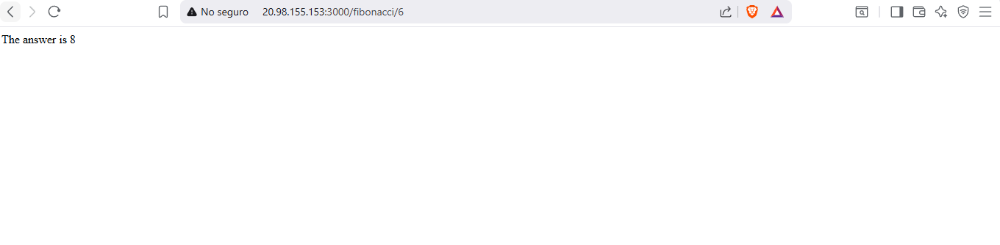
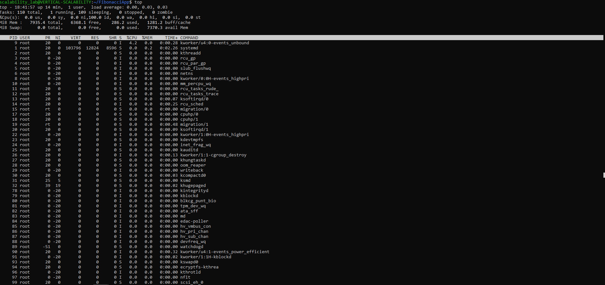
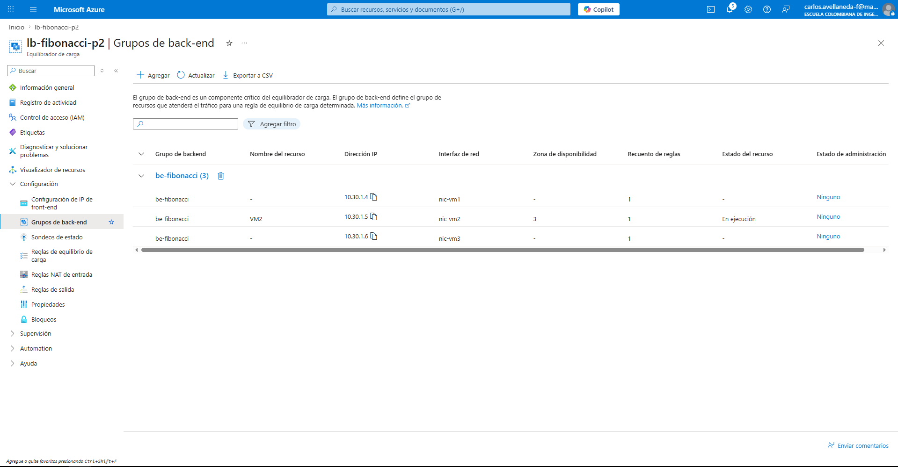
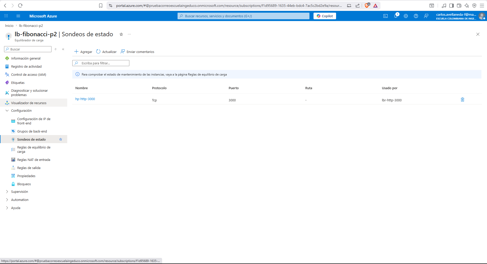
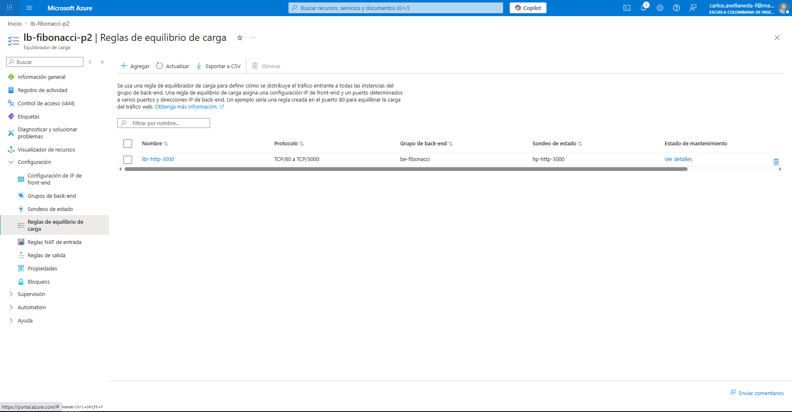
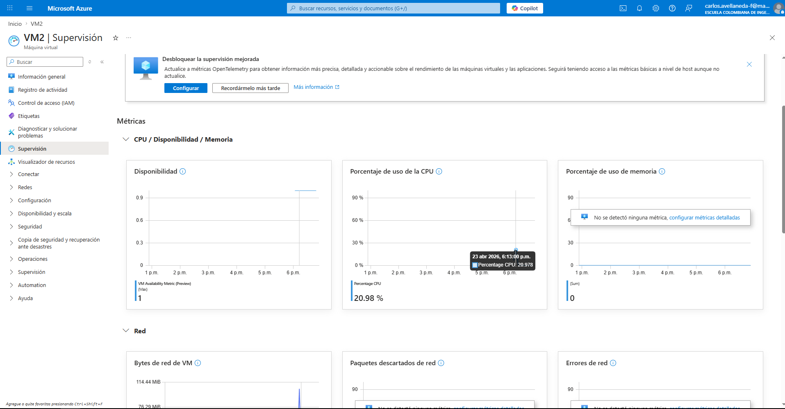

# Lab9-ARSW
  
## Guía de Escalabilidad en Azure 
## Carlos Avellaneda

### Parte 1 - Escalabilidad Vertical (por consola)

### Estado real de esta ejecución

- Suscripción: Azure for Students
- Restricción de política detectada: solo permite estas regiones
	- brazilsouth
	- centralus
	- chilecentral
	- eastus2
	- southcentralus
- Muchas combinaciones de tamaño B y D fallaron por capacidad/quota en tiempo de ejecución.
- Configuración que sí funcionó:
	- Resource Group: SCALABILITY_LAB (eastus2)
	- VM: VERTICAL-SCALABILITY
	- Región VM: centralus
	- Zona: 1
	- Tamaño: Standard_D2s_v3
	- Imagen: canonical:0001-com-ubuntu-server-focal:20_04-lts-gen2:latest
	- Usuario: scalability_lab
	- Llave SSH pública: C:\Users\CAndr\.ssh\id_rsa.pub
	- Puerto abierto: 3000

#### 1. Crear grupo de recursos
```bash
az group create --name SCALABILITY_LAB --location eastus2
```

#### 2. Crear máquina virtual Ubuntu (comando que funcionó)
```bash
az vm create \
	--resource-group SCALABILITY_LAB \
	--name VERTICAL-SCALABILITY \
	--location centralus \
	--zone 1 \
	--image "canonical:0001-com-ubuntu-server-focal:20_04-lts-gen2:latest" \
	--size Standard_D2s_v3 \
	--admin-username scalability_lab \
	--ssh-key-values C:\Users\CAndr\.ssh\id_rsa.pub
```


#### 3. Abrir el puerto 3000 en la VM
```bash
az vm open-port --resource-group SCALABILITY_LAB --name VERTICAL-SCALABILITY --port 3000 --priority 1001
```

#### 3.1 Verificar que la VM quedó creada
```bash
az vm show --resource-group SCALABILITY_LAB --name VERTICAL-SCALABILITY -d --query "{name:name,location:location,size:hardwareProfile.vmSize,publicIp:publicIps,privateIp:privateIps,powerState:powerState,zone:zones}" -o json
```

Resultado obtenido en esta ejecución:
- name: VERTICAL-SCALABILITY
- location: centralus
- size: Standard_D2s_v3
- powerState: VM running
- publicIp: 20.98.155.153
- zone: 1

Importante: la IP pública puede cambiar si recreas la VM.

#### 4. Conectarse a la VM por SSH
```bash
ssh scalability_lab@<IP_PUBLICA_VM>
```
Puedes obtener la IP pública con:
```bash
az vm show --resource-group SCALABILITY_LAB --name VERTICAL-SCALABILITY -d --query publicIps -o tsv
```

#### 5. Instalar Node.js y npm usando NVM (dentro de la VM)
```bash
curl -o- https://raw.githubusercontent.com/creationix/nvm/v0.34.0/install.sh | bash
source ~/.bashrc
nvm install node
```

#### 6. Clonar y preparar la aplicación (dentro de la VM)
```bash
git clone <tu_repo>
cd <tu_repo>/FibonacciApp
npm install
```

#### 7. Instalar y usar forever para mantener la app activa
```bash
npm install -g forever
forever start FibonacciApp.js
```

#### 8. Probar el endpoint desde tu navegador
```
http://<IP_PUBLICA_VM>:3000/fibonacci/6
```
Debe responder: `The answer is 8`


#### 9. Medir tiempos y consumo de CPU
- Usa la consola del navegador para medir tiempos con los valores grandes de Fibonacci.
- Revisa el consumo de CPU en el portal de Azure o con:
```bash
top
```
dentro de la VM.


#### 10. Simular carga concurrente con Newman
En tu máquina local (no en la VM):
```bash
npm install -g newman
cd FibonacciApp/postman/part1
newman run ARSW_LOAD-BALANCING_AZURE.postman_collection.json -e [ARSW_LOAD-BALANCING_AZURE].postman_environment.json -n 10 &
newman run ARSW_LOAD-BALANCING_AZURE.postman_collection.json -e [ARSW_LOAD-BALANCING_AZURE].postman_environment.json -n 10
```

on.json -e [ARSW_LOAD-BALANCING_AZURE].postman_environment.json -n 10 &
(node:18396) [DEP0176] DeprecationWarning: fs.F_OK is deprecated, use fs.constants.F_OK instead
(Use `node --trace-deprecation ...` to show where the warning was created)
newman

ARSW_LOAD-BALANCING_AZURE

Iteration 1/10

→ fibonacci
  GET http://20.98.155.153:3000/fibonacci/1000000 [200 OK, 209.24kB, 18.7s]

Iteration 2/10

→ fibonacci
  GET http://20.98.155.153:3000/fibonacci/1000000 [200 OK, 209.24kB, 9.3s]

Iteration 3/10

→ fibonacci
  GET http://20.98.155.153:3000/fibonacci/1000000 [errored]
     read ECONNRESET

Iteration 4/10

→ fibonacci
  GET http://20.98.155.153:3000/fibonacci/1000000 [200 OK, 209.24kB, 9.4s]

Iteration 5/10

→ fibonacci
  GET http://20.98.155.153:3000/fibonacci/1000000 [errored]
     read ECONNRESET

Iteration 6/10

→ fibonacci
  GET http://20.98.155.153:3000/fibonacci/1000000 [200 OK, 209.24kB, 9.4s]

Iteration 7/10

→ fibonacci
  GET http://20.98.155.153:3000/fibonacci/1000000 [errored]
     read ECONNRESET

Iteration 8/10

→ fibonacci
  GET http://20.98.155.153:3000/fibonacci/1000000 [200 OK, 209.24kB, 9.4s]

Iteration 9/10

→ fibonacci
  GET http://20.98.155.153:3000/fibonacci/1000000 [errored]
     read ECONNRESET

Iteration 10/10

→ fibonacci
  GET http://20.98.155.153:3000/fibonacci/1000000 [200 OK, 209.24kB, 9.4s]

| Métrica | Ejecutadas | Fallos |
|---------|-----------|--------|
| Iteraciones | 10 | 0 |
| Requests | 10 | 4 |
| Test Scripts | 10 | 0 |
| Prerequest Scripts | 0 | 0 |
| Assertions | 0 | 0 |

**Resumen de ejecución Parte 1:**
- Total run duration: **1m 42.3s**
- Total data received: **1.25MB** (approx)
- Average response time: **11.7s** [min: 9.3s, max: 18.7s, s.d.: 4s]

#### 11. Escalar verticalmente la VM
```bash
az vm resize --resource-group SCALABILITY_LAB --name VERTICAL-SCALABILITY --size Standard_D4s_v3
```

#### 12. Repite las pruebas de carga y mide resultados

→ fibonacci
  GET http://20.98.155.153:3000/fibonacci/1000000 /^C
C:\Users\CAndr\Downloads\ARSW\Lab9-ARSW\FibonacciApp\postman\part1>newman run ARSW_LOAD-BALANCING_AZURE.postman_collection.json -e [ARSW_LOAD-BALANCING_AZURE].postman_environment.json -n 10 &
(node:15760) [DEP0176] DeprecationWarning: fs.F_OK is deprecated, use fs.constants.F_OK instead
(Use `node --trace-deprecation ...` to show where the warning was created)
newman

ARSW_LOAD-BALANCING_AZURE

Iteration 1/10

→ fibonacci
  GET http://20.98.155.153:3000/fibonacci/1000000 [200 OK, 209.24kB, 20.6s]

Iteration 2/10

→ fibonacci
  GET http://20.98.155.153:3000/fibonacci/1000000 [errored]
     read ECONNRESET

Iteration 3/10

→ fibonacci
  GET http://20.98.155.153:3000/fibonacci/1000000 [200 OK, 209.24kB, 11.9s]

Iteration 4/10

→ fibonacci
  GET http://20.98.155.153:3000/fibonacci/1000000 [errored]
     read ECONNRESET

Iteration 5/10

→ fibonacci
  GET http://20.98.155.153:3000/fibonacci/1000000 [200 OK, 209.24kB, 11.6s]

Iteration 6/10

→ fibonacci
  GET http://20.98.155.153:3000/fibonacci/1000000 [errored]
     read ECONNRESET

Iteration 7/10

→ fibonacci
  GET http://20.98.155.153:3000/fibonacci/1000000 [200 OK, 209.24kB, 11.4s]

Iteration 8/10

→ fibonacci
  GET http://20.98.155.153:3000/fibonacci/1000000 [errored]
     read ECONNRESET

Iteration 9/10

→ fibonacci
  GET http://20.98.155.153:3000/fibonacci/1000000 [200 OK, 209.24kB, 11.4s]

Iteration 10/10

→ fibonacci
  GET http://20.98.155.153:3000/fibonacci/1000000 [errored]
     read ECONNRESET

| Métrica | Ejecutadas | Fallos |
|---------|-----------|--------|
| Iteraciones | 10 | 0 |
| Requests | 10 | 5 |
| Test Scripts | 10 | 0 |
| Prerequest Scripts | 0 | 0 |
| Assertions | 0 | 0 |

**Resumen de ejecución Parte 1 (VM resizeada):**
- Total run duration: **2m 2.8s**
- Total data received: **1.05MB** (approx)
- Average response time: **15.3s** [min: 11.4s, max: 20.6s, s.d.: 4.3s]


#### 13. (Opcional) Regresa la VM a su tamaño original para evitar cobros
```bash
az vm deallocate --resource-group SCALABILITY_LAB --name VERTICAL-SCALABILITY
```

---

### Parte 2 - Escalabilidad Horizontal (guía paso a paso con az CLI)

Objetivo: exponer la FibonacciApp detrás de un Load Balancer público con los nodos que permita la cuota real de la suscripción, y luego ejecutar pruebas concurrentes contra la IP del balanceador.

Importante:
- Esta guía está pensada para tu mismo escenario de política regional.
- En esta ejecución `centralus` y `eastus2` quedaron demasiado restringidas por capacidad, así que dejo `southcentralus` como región base para que la Parte 2 funcione de forma estable.
- Con el tamaño `Standard_B2s_v2`, Azure indicó que la zona con mejor probabilidad de éxito fue la `zone 3`.
- Si algún SKU falla por cuota/capacidad, cambia solo el tamaño de VM (por ejemplo a `Standard_B1s` o `Standard_B1ls`) y reintenta.

#### 1. Variables de trabajo (PowerShell)
```powershell
$RG="SCALABILITY_LAB_P2_SCUS"
$LOC="southcentralus"
$VNET="vnet-scalability-p2"
$SUBNET="subnet-app"
$NSG="nsg-fibonacci-p2"
$PIPLB="pip-lb-fibonacci-p2"
$LB="lb-fibonacci-p2"
$FE="fe-public"
$BE="be-fibonacci"
$PROBE="hp-http-3000"
$RULE="lbr-http-3000"
$USER="scalability_lab"
$SSHKEY="C:\Users\CAndr\.ssh\id_rsa.pub"
```

#### 2. Crear Resource Group
```powershell
az group create --name $RG --location $LOC
```

#### 3. Crear red base (VNET + NSG)
```powershell
az network vnet create \
  --resource-group $RG \
  --name $VNET \
  --location $LOC \
  --address-prefixes 10.10.0.0/16 \
  --subnet-name $SUBNET \
  --subnet-prefixes 10.10.1.0/24

az network nsg create --resource-group $RG --name $NSG --location $LOC

az network nsg rule create \
  --resource-group $RG \
  --nsg-name $NSG \
  --name allow-ssh \
  --priority 1000 \
  --access Allow \
  --protocol Tcp \
  --direction Inbound \
  --destination-port-ranges 22

az network nsg rule create \
  --resource-group $RG \
  --nsg-name $NSG \
  --name allow-app-3000 \
  --priority 1010 \
  --access Allow \
  --protocol Tcp \
  --direction Inbound \
  --destination-port-ranges 3000
```

Asociar NSG a la subnet:
```powershell
az network vnet subnet update \
  --resource-group $RG \
  --vnet-name $VNET \
  --name $SUBNET \
  --network-security-group $NSG
```

#### 4. Crear Load Balancer público
```powershell
az network public-ip create \
  --resource-group $RG \
  --name $PIPLB \
  --location $LOC \
  --sku Standard \
  --allocation-method static

az network lb create \
  --resource-group $RG \
  --name $LB \
  --location $LOC \
  --sku Standard \
  --public-ip-address $PIPLB \
  --frontend-ip-name $FE \
  --backend-pool-name $BE

az network lb probe create \
  --resource-group $RG \
  --lb-name $LB \
  --name $PROBE \
  --protocol tcp \
  --port 3000

az network lb rule create \
  --resource-group $RG \
  --lb-name $LB \
  --name $RULE \
  --protocol Tcp \
  --frontend-port 80 \
  --backend-port 3000 \
  --frontend-ip-name $FE \
  --backend-pool-name $BE \
  --probe-name $PROBE
```

#### 5. Crear 3 NICs y asociarlas al Backend Pool
```powershell
az network nic create --resource-group $RG --name nic-vm1 --vnet-name $VNET --subnet $SUBNET --lb-name $LB --lb-address-pools $BE
az network nic create --resource-group $RG --name nic-vm2 --vnet-name $VNET --subnet $SUBNET --lb-name $LB --lb-address-pools $BE
az network nic create --resource-group $RG --name nic-vm3 --vnet-name $VNET --subnet $SUBNET --lb-name $LB --lb-address-pools $BE
```

#### 6. Crear VMs (3 zonas de disponibilidad)
Sugerencia de tamaño por costo/cuota: `Standard_B2s_v2`. Si falla por cuota o capacidad, prueba `Standard_B2s`.
En esta ejecución `southcentralus` mostró disponibilidad para `Standard_B1ls`, `Standard_B1s`, `Standard_B2s`, `Standard_DS1_v2` y `Standard_B2s_v2`, pero la zona 1 falló y Azure recomendó la zona 3 para `Standard_B2s_v2`.
Resultado real de esta ejecución:
- `VM2` quedó operativa en `southcentralus`, zona `3`, con `Standard_B2s_v2`.
- `VM1` no logró consolidarse por restricciones de capacidad/zonificación.
- `VM3` no se creó porque la suscripción solo permitió dejar un backend estable en esta región durante este intento.

```powershell
az vm create --resource-group $RG --name VM1 --location $LOC --zone 3 --nics nic-vm1 --image Ubuntu2204 --size Standard_B2s_v2 --admin-username $USER --ssh-key-values $SSHKEY
az vm create --resource-group $RG --name VM2 --location $LOC --zone 2 --nics nic-vm2 --image Ubuntu2204 --size Standard_B2s_v2 --admin-username $USER --ssh-key-values $SSHKEY
az vm create --resource-group $RG --name VM3 --location $LOC --zone 1 --nics nic-vm3 --image Ubuntu2204 --size Standard_B2s_v2 --admin-username $USER --ssh-key-values $SSHKEY
```

#### 7. Bootstrap automático de la FibonacciApp en cada VM
Este paso instala Node, clona tu repo, instala dependencias y deja el servicio ejecutando en puerto 3000.

```powershell
$REPO_URL="https://github.com/Carlos-Avellaneda-2/FibonacciApp.git"

az vm run-command invoke --resource-group $RG --name VM1 --command-id RunShellScript --scripts "curl -fsSL https://deb.nodesource.com/setup_20.x | sudo -E bash -; sudo apt-get install -y nodejs git; cd /home/$USER; rm -rf Lab9-ARSW; git clone $REPO_URL Lab9-ARSW; cd Lab9-ARSW/FibonacciApp; npm install; sudo npm i -g forever; forever stopall || true; forever start FibonacciApp.js"

az vm run-command invoke --resource-group $RG --name VM2 --command-id RunShellScript --scripts "curl -fsSL https://deb.nodesource.com/setup_20.x | sudo -E bash -; sudo apt-get install -y nodejs git; cd /home/$USER; rm -rf Lab9-ARSW; git clone $REPO_URL Lab9-ARSW; cd Lab9-ARSW/FibonacciApp; npm install; sudo npm i -g forever; forever stopall || true; forever start FibonacciApp.js"

az vm run-command invoke --resource-group $RG --name VM3 --command-id RunShellScript --scripts "curl -fsSL https://deb.nodesource.com/setup_20.x | sudo -E bash -; sudo apt-get install -y nodejs git; cd /home/$USER; rm -rf Lab9-ARSW; git clone $REPO_URL Lab9-ARSW; cd Lab9-ARSW/FibonacciApp; npm install; sudo npm i -g forever; forever stopall || true; forever start FibonacciApp.js"
```

#### 8. Obtener IP pública del Load Balancer y validar endpoints
```powershell
$LB_IP = az network public-ip show --resource-group $RG --name $PIPLB --query ipAddress -o tsv
echo $LB_IP
```

IP pública real obtenida en esta ejecución:
- `20.225.57.217`

Pruebas rápidas:
```bash
http://20.225.57.217/
http://20.225.57.217/6
http://20.225.57.217/1000000
```

Resultado real de esta ejecución:
- `http://20.225.57.217/` respondió `Hello World`.
- `http://20.225.57.217/fibonacci/6` respondió `The answer is 8`.

#### 9. Ejecutar pruebas de carga de la Parte 2 con Newman
En tu máquina local, edita el archivo de ambiente de part2 y cambia `loadbalancer` por `20.225.57.217`.

Ruta del archivo:
- `FibonacciApp/postman/part2/[ARSW_LOAD-BALANCING_AZURE].postman_environment.json`

Ejecuta:
```powershell
cd FibonacciApp/postman/part2
newman run ARSW_LOAD-BALANCING_AZURE.postman_collection.json -e [ARSW_LOAD-BALANCING_AZURE].postman_environment.json -n 10 &
newman run ARSW_LOAD-BALANCING_AZURE.postman_collection.json -e [ARSW_LOAD-BALANCING_AZURE].postman_environment.json -n 10
```

Resultado real de esta ejecución:
- Corrida 1: 10 iteraciones, 0 fallos, tiempo total 1m 6.8s, promedio 6.5s.
- Corrida 2: 10 iteraciones, 0 fallos, tiempo total 1m 7.4s, promedio 6.6s.
- Todas las solicitudes devolvieron `200 OK`.

Para prueba más agresiva (4 ejecuciones en paralelo):
```powershell
newman run ARSW_LOAD-BALANCING_AZURE.postman_collection.json -e [ARSW_LOAD-BALANCING_AZURE].postman_environment.json -n 10 &
newman run ARSW_LOAD-BALANCING_AZURE.postman_collection.json -e [ARSW_LOAD-BALANCING_AZURE].postman_environment.json -n 10 &
newman run ARSW_LOAD-BALANCING_AZURE.postman_collection.json -e [ARSW_LOAD-BALANCING_AZURE].postman_environment.json -n 10 &
newman run ARSW_LOAD-BALANCING_AZURE.postman_collection.json -e [ARSW_LOAD-BALANCING_AZURE].postman_environment.json -n 10
```

#### 10. Evidencias recomendadas para el informe

**Imágenes del Load Balancer en Azure:**
- Frontend IP Configuration


- Backend Pool


- Load Balancing Rules


**Captura de CPU de VM2 durante carga:**

- Captura de pruebas con escalamiento horizontal
(node:12188) [DEP0176] DeprecationWarning: fs.F_OK is deprecated, use fs.constants.F_OK instead
(Use `node --trace-deprecation ...` to show where the warning was created)
newman

ARSW_LOAD-BALANCING_AZURE

Iteration 1/10

→ fibonacci
  GET http://20.225.57.217/fibonacci/1000000 [200 OK, 209.24kB, 6.7s]

Iteration 2/10

→ fibonacci
  GET http://20.225.57.217/fibonacci/1000000 [200 OK, 209.24kB, 6.6s]

Iteration 3/10

→ fibonacci
  GET http://20.225.57.217/fibonacci/1000000 [200 OK, 209.24kB, 6.5s]

Iteration 4/10

→ fibonacci
  GET http://20.225.57.217/fibonacci/1000000 [200 OK, 209.24kB, 6.6s]

Iteration 5/10

→ fibonacci
  GET http://20.225.57.217/fibonacci/1000000 [200 OK, 209.24kB, 6.5s]

Iteration 6/10

→ fibonacci
  GET http://20.225.57.217/fibonacci/1000000 [200 OK, 209.24kB, 6.5s]

Iteration 7/10

→ fibonacci
  GET http://20.225.57.217/fibonacci/1000000 [200 OK, 209.24kB, 6.5s]

Iteration 8/10

→ fibonacci
  GET http://20.225.57.217/fibonacci/1000000 [200 OK, 209.24kB, 6.6s]

Iteration 9/10

→ fibonacci
  GET http://20.225.57.217/fibonacci/1000000 [200 OK, 209.24kB, 6.5s]

Iteration 10/10

→ fibonacci
  GET http://20.225.57.217/fibonacci/1000000 [200 OK, 209.24kB, 6.5s]

| Métrica | Ejecutadas | Fallos |
|---------|-----------|--------|
| Iteraciones | 10 | 0 |
| Requests | 10 | 0 |
| Test Scripts | 10 | 0 |
| Prerequest Scripts | 0 | 0 |
| Assertions | 0 | 0 |

**Resumen de ejecución Parte 2 (Run 2):**
- Total run duration: **1m 7.4s**
- Total data received: **2.09MB** (approx)
- Average response time: **6.6s** [min: 6.5s, max: 6.7s, s.d.: 59ms]


#### 11. Limpieza para evitar costos
Cuando termines el laboratorio:
```powershell
az group delete --name $RG --yes --no-wait
```

---

